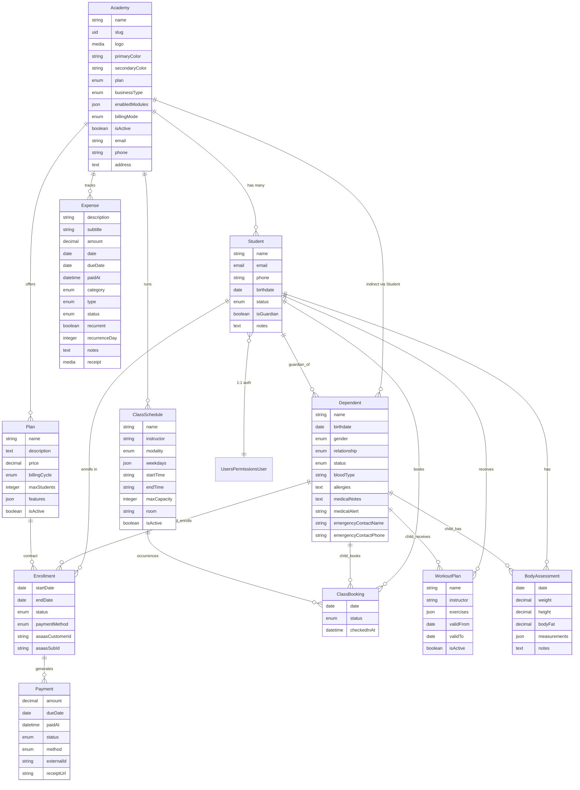
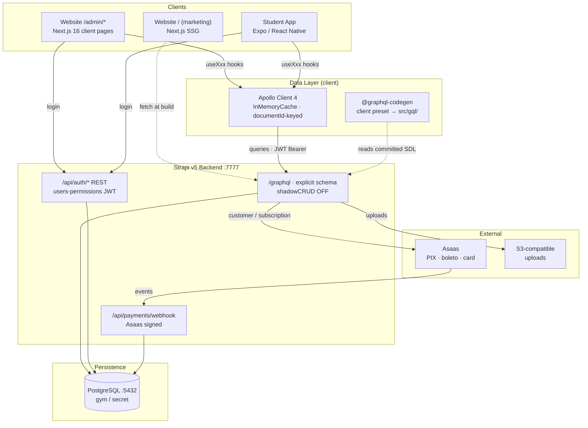
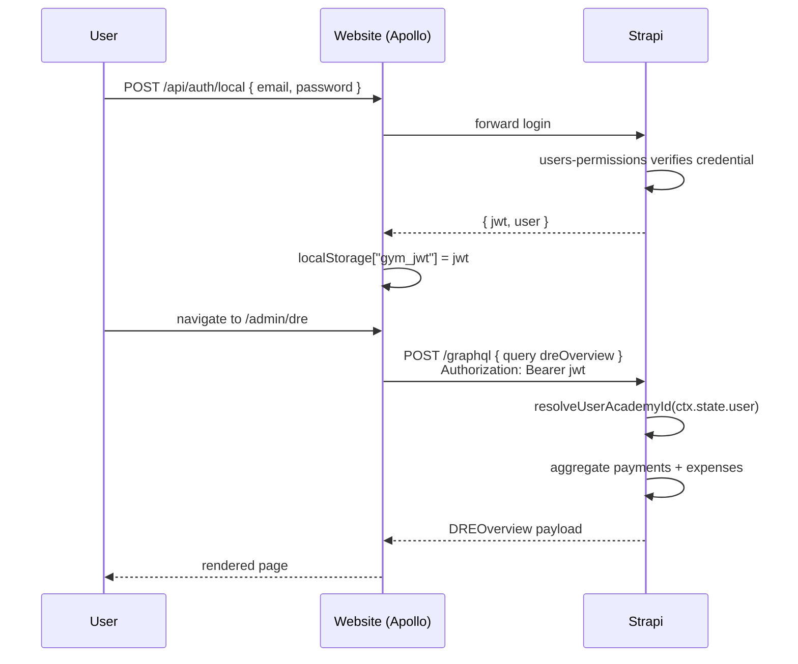

# Architecture

A single source of truth for the data model, the service graph, and how
frontend surfaces talk to the backend. Keep this in sync with
`backend/schema.graphql`, `website/src/lib/hooks.ts`, and
`docs/design-decisions.md`.

> Diagrams are Mermaid so they render on GitHub / most Markdown viewers.
> If you add a new content type or an aggregate resolver, update this
> file **in the same commit** (see `docs/design-decisions.md §9.6`).

## Database ERD



## System architecture



## Content-type registry

| UID | Purpose | Academy-scoped | New |
|---|---|---|---|
| `api::academy.academy` | Tenant root, branding, business type | — | no |
| `api::student.student` | Academy member / practitioner | yes | no |
| `api::plan.plan` | Membership plan | yes | no |
| `api::enrollment.enrollment` | Student↔Plan contract | via student | no |
| `api::class-schedule.class-schedule` | Recurring class | yes | no |
| `api::class-booking.class-booking` | Specific occurrence booking | via student | no |
| `api::payment.payment` | Payment instalment | via enrollment | no |
| `api::workout-plan.workout-plan` | Personalised training plan | via student | no |
| `api::body-assessment.body-assessment` | Physical evaluation | via student | no |
| `api::expense.expense` | Operational expense | yes | **yes** |
| `api::dependent.dependent` | Minor enrolled by a guardian Student | yes | **yes** |

## GraphQL surface

Custom queries (beyond standard CRUD):

| Query | Auth | Returns | Page |
|---|---|---|---|
| `academyBySlug(slug)` | public | Academy branding | white-label theming |
| `me` | required | Student w/ academy, enrollments, workouts | app dashboard |
| `myDependents` | required | Guardian's children | app `/dependents` |
| `scheduleBookings(documentId, date)` | required | Bookings for a class on a date | admin schedule |
| `adminDashboard` | required | Metrics + recent students + today + upcoming | `/admin/dashboard` |
| `financeOverview(month, year)` | required | KPIs + charges + method split | `/admin/finance` |
| `dreOverview(month, year)` | required | Revenue/expenses/profit + 6mo cashflow + categories | `/admin/dre` |
| `scheduleWeek(weekStart)` | required | Weekly grid + stats + upcoming | `/admin/schedule` |
| `guardians` | required | Families (guardian + dependents list) | `/admin/dependents` |
| `workoutPlans` | required | All workout plans for the academy | `/admin/workouts` |

Mutations of note:

| Mutation | Side effects |
|---|---|
| `createStudent` | none (enrollment follows) |
| `createEnrollment` | `afterCreate` lifecycle → Asaas customer + subscription |
| `updateEnrollment{status:cancelled}` | `afterUpdate` lifecycle → Asaas subscription cancel |
| `checkInBooking` | stamps `checkedInAt` |
| `createExpense` | auto-scopes to caller's academy |
| `createDependent` | auto-flips guardian's `Student.isGuardian = true` |

## Frontend hook ↔ query map

### Website (`website/src/lib/hooks.ts`)

| Hook | Domain type | Query | Status |
|---|---|---|---|
| `usePricingPlans` | `PricingPlan[]` | `plans` | ✅ wired |
| `useDashboard` | `DashboardData` | `adminDashboard` | ✅ wired |
| `useStudents` | `StudentRow[]` | `students` | ✅ wired |
| `useFinance` | `FinanceData` | `financeOverview` | ✅ wired |
| `useSchedule` | `ScheduleData` | `scheduleWeek` | ✅ wired |
| `useAcademy` | `AcademySettings` | `me.academy` | ✅ wired |
| `useDRE` | `DREData` | `dreOverview` | ✅ wired |
| `useDependents` | `GuardianFamily[]` | `guardians` | ✅ wired |
| `useWorkouts` | `WorkoutsData` | `workoutPlans` | ✅ wired |

Each hook respects `NEXT_PUBLIC_USE_MOCKS`:
- `true` → synchronous `MOCK_*` fixture
- `false` → `useQuery` against the endpoint in `NEXT_PUBLIC_GRAPHQL_ENDPOINT`

### Student app (`app/hooks/`)

| Hook | Query | Status |
|---|---|---|
| `useDashboard` | `MyDashboard` (inline) | ✅ wired |
| `useDependents` | `AppMyDependents` (me + myDependents) | ✅ wired |
| `useSchedule` | — | ⏳ mock only (fixture imported directly) |
| `useWorkouts` | — | ⏳ mock only |
| `usePayments` | — | ⏳ mock only |
| `useProfile` | — | ⏳ mock only |

The pending ones are simple wrappers around `me.{bookings|workoutPlans|payments}` subfield queries — same shape, same mapping pattern as `useDependents`.

## Permissions

Two decoupled layers:

**users-permissions (Strapi plugin)** — default roles only. Every API
caller is either `Public` (only the Asaas webhook is enabled) or
`Authenticated` (anything else requires a JWT). `src/bootstrap/permissions.ts`
also removes any legacy `academy_admin`/`instructor`/`student` rows
that older boots created.

**Gym role on `Student.role`** — the academy-facing role lives on the
Student content type:

| `Student.role` | Access |
|---|---|
| `academy_admin` | Full CRUD on their academy's data — finance, students, expenses, dependents |
| `instructor` | Read students, manage schedules, write assessments + workouts |
| `member` (default) | Read own data, book classes, view own workouts |

GraphQL resolvers look up the caller's `Student` via the
`resolveUserAcademyId` helper (in `src/extensions/graphql/helpers.ts`)
and branch on `Student.role` as needed. `resolversConfig.auth` stays
`true` for everything except `Query.academyBySlug`.

### Dev login (SEED_DEMO=true)

`bootstrap/seed.ts → ensureDemoDevUser` runs on every
`SEED_DEMO=true` boot and idempotently provisions:

- a users-permissions user `admin@gym-demo.com` / `gym-demo-admin`
  (overridable via `DEV_USER_EMAIL` / `DEV_USER_PASSWORD`), assigned
  the default `Authenticated` role
- Ana Costa's Student record linked to that user, `role = academy_admin`

Credentials are printed prominently in the boot log so the operator
doesn't have to grep source.

## Authentication flow



## Switching a frontend to live data

```bash
# 1. Start backend
cd backend && npm run develop      # :7777

# 2. Flip the website toggle + point at the backend
cd website
cat > .env.local <<'EOF'
NEXT_PUBLIC_USE_MOCKS=false
NEXT_PUBLIC_GRAPHQL_ENDPOINT=http://localhost:7777/graphql
NEXT_PUBLIC_SITE_ORIGIN=http://localhost:9999
EOF
npm run dev                        # :9999

# 3. Log in at http://localhost:9999/login with a seeded academy_admin
# 4. Every /admin/* page now runs one round-trip against the aggregate
#    resolvers. Mock fixtures remain available by flipping the flag back.
```

## Pending work

- **App hooks for schedule/workouts/payments/profile** — trivial once
  the backend `me.*` subfield resolvers return the full shape (they
  partially do today). ~1h each.
- **N+1 on aggregate resolvers** — `dreOverview` and `financeOverview`
  eager-load every payment/expense and aggregate in memory. Fine at
  Gym Demo volumes; move to SQL aggregates (`strapi.db.connection.raw`)
  once a real academy crosses a few thousand rows.
- **Dependent billing mode** — `Academy.billingMode` exists but
  `createEnrollment` doesn't yet route a family's payments onto the
  guardian's Asaas customer when `billingMode === 'per_family'`. Spec
  lives in `backend/CLAUDE.md §Módulo de Dependentes`.
- **Pool / Documents / Makeups / Progress / Terms / Resources modules**
  — content types not built (stubs in mockups); feature flags already
  exist on `Academy.enabledModules`.
